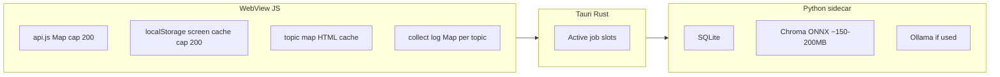

# Gap Map — memory leak analysis

**Date:** 2026-05-28  
**Scope:** Tauri desktop app (`app-tauri`) — JS webview, Rust host, Python sidecar.

---

## Executive summary

Gap Map is **mostly bounded** on the JS side (capped API cache, screen cache eviction, collect log cap per topic). The largest confirmed **webview leak** was **duplicate `window` listeners** on every topic page visit — fixed in this session.

**Real memory growth** during heavy use usually comes from:

1. **Python sidecar RSS** (Chroma/ONNX, collect, enrich) — not a classic JS leak.
2. **Intentional caches** (map HTML, tab DOM, API responses) — bounded but large.
3. **Stale listeners / timers** on screens that poll without `hashchange` cleanup — several fixed or low severity.

Use the built-in probe: **`await window.__gapmapMemStats()`** in DevTools (see `api.js`).

---

## How to measure (repeatable)

### 1. Webview (JavaScript)

Open DevTools in dev build (`npm run tauri dev`) or enable webview inspector on production.

```javascript
// Sample before and after a workflow; diff the counters.
await window.__gapmapMemStats()
```

Watch:

| Field | Healthy behavior |
|--------|------------------|
| `js.api_cache_size` | Plateaus ≤ 200 |
| `js.heap_used_mb` | Rises then flat after GC |
| `js.cache_keys_sample` | Rotates, not infinite unique keys |

Chrome also exposes `performance.memory` (included in `__gapmapMemStats` when available).

### 2. Rust + Python (host process)

Same call returns `rust.rust_rss_mb` and `rust.sidecars[].rss_mb`.

| Field | Concern if… |
|--------|-------------|
| `rust_rss_mb` | Grows without sidecar activity |
| `sidecars[].rss_mb` | Stays high after collect/enrich finished |
| `slots.graph_inflight_count` | > 0 while idle (stuck lock) |
| `slots.active_collects` | Non-empty with no visible collect |

### 3. macOS Activity Monitor

- **Gap Map** = Rust + WebView.
- Child **Python** processes = sidecar (often 200 MB–1 GB+ during enrich / Chroma).

---

## Architecture (where memory lives)



---

## Findings by severity

### Critical (fixed 2026-05-28)

#### Topic page: `gapmap:changed` listeners never removed

**File:** `app-tauri/src/screens/topic.js`

Each `renderTopic()` registered:

- `window.addEventListener('gapmap:changed', onGapmapChangedTask8)`
- `window.addEventListener('gapmap:db-changed', onDbChangedTask8)`

**No `removeEventListener` on navigate away.** Visiting 20 topics → 40 handlers; every DB mutation ran 40 refresh paths → CPU + retained closures → felt like “app gets slower / blank / weird tabs.”

**Fix:** `hashCleanup` now removes both listeners, clears `changedRefreshTimer`, and drains `_activeEnrichUnlistens`.

---

### High (mitigated 2026-05-28)

#### Collect log Map unbounded across topics

**File:** `app-tauri/src/screens/collect.js`

`_collectLogs` kept up to **5000 lines per topic** forever. Ten aggressive collects ≈ tens of MB of log strings in RAM.

**Fix:** Delete `_collectLogs` / `_collectStart` for a topic when `collect:done` fires (done / failed / cancelled).

#### Agents orchestra: 5s poll after navigate away

**File:** `app-tauri/src/screens/personas.js`

Polling stopped only on next `tick()` (up to 5s late). **Fix:** `hashchange` → `stop()` immediately.

---

### Medium (known / partial mitigation)

| Issue | Location | Notes |
|--------|-----------|--------|
| **Map render cache** | `topic.js` `_mapRenderCache` + localStorage | Large HTML strings per topic; 7-day TTL; grows with # topics opened |
| **Tab DOM cache** | `topic.js` `tabDomCache` | Detached DOM trees per tab per topic; freed when leaving topic (root replaced) |
| **Chat history** | `topic.js` `chatHistory` Map | Grows per topic; unbounded topic keys over long sessions |
| **main.js `route()` remount** | `main.js` | `gapmap:changed` can call `route()` on list screens → full re-render; intentional but allocates |
| **MCP / external DB writes** | `api.js` poller | Every 5s mtime check; external writes → `clearApiCache` + events (not a leak, but churn) |
| **Python Chroma idle** | `palace.py` | Memory governor drops client when RSS high; enrichment worker sets `keep_alive=0` for Ollama |
| **Stuck graph inflight** | Rust `ActiveGraphOps` | Shows in `mem_stats`; causes duplicate work, not always RSS leak |

---

### Low / by design

| Mechanism | Cap / cleanup |
|-----------|----------------|
| `api.js` `_cache` | 200 entries, evict oldest 25% |
| `screenCache.js` | 200 localStorage entries, 7-day TTL |
| `CollectReconCard` STORE | 8 topics max |
| `collect.js` lines per topic | 5000 max per topic |
| `watch.js` hits | 200 ring buffer |
| `tabs.js` | 50 tabs max |
| `home.js` | `routeGen` + `alive()` clears interval + db listener |
| `collect.js` screen | Full cleanup on `hashchange` |
| `tasks.js` | `clearInterval` + `observer.disconnect()` |
| `activity.js` | cleanup on hashchange |
| Global collect listeners | Bound once (`_globalCollectListenersBound`) |

---

## Screens audit (timers & listeners)

| Screen | Poll / timer | Cleanup |
|--------|----------------|---------|
| Home | 30s interval, db-changed | ✅ `alive()` + routeGen |
| Collect | 1s + 2s intervals | ✅ hashchange cleanup |
| Topic | 4s chip poll, gapmap:changed | ✅ hashchange (after fix) |
| Tasks | 2s poll | ✅ disconnect on leave |
| Collects | 2s refresh | ✅ hashchange |
| Activity | refresh timer | ✅ hashchange |
| Sentiment | intervals | ✅ clear on completion |
| Audience build | 1.5s poll | ✅ clear after build |
| Agents orchestra | 5s | ✅ hashchange (after fix) |
| CollectStatusBar | 2s global | ✅ intentional app lifetime |
| api freshness | 5s global | ✅ intentional app lifetime |
| Settings palace warm | interval while warming | ✅ clearInterval in handlers |

---

## Python / Rust (not JS leaks)

1. **Collect + parallel sources** — spikes RSS during fetch; should drop after job ends.
2. **Enrichment** — LLM + graph build; Chroma model ~80–200 MB.
3. **Orphan sidecar** — if process killed without `collect:done`, slots may look stuck; use Task Manager / cancel.
4. **Multiple collects** — only one Rust slot; JS `_collectLogs` was the main multi-topic JS issue.

Enrichment worker includes a **memory governor** (see `desktop-incremental-enrichment` skill): Chroma idle drop, Ollama `keep_alive=0`, RSS ceiling, OOM restart.

---

## Recommended workflows to stress-test

Run `await window.__gapmapMemStats()` at start, then:

1. Open **15 different topics** (Map tab each) → check `js.heap_used_mb` and listener count (Performance monitor: Event Listeners).
2. Run **3 collects** on different topics → check `rust.sidecars` RSS after each finishes.
3. Leave **Agents orchestra** 2 min, navigate away → CPU should idle (no 5s API spam).
4. **Enrich** on Map, navigate away mid-stream → enrich should cancel or complete without growing listeners.
5. **Hard refresh** `⌘⇧R` (main.js) → clears api cache + dashboard cache; heap should drop partially.

---

## Fixes applied (2026-05-28)

| File | Change |
|------|--------|
| `topic.js` | Remove `gapmap:changed` / `gapmap:db-changed` on hashchange; clear enrich unlistens |
| `personas.js` | Stop orchestra interval on hashchange |
| `collect.js` | Delete `_collectLogs` for topic on `collect:done` |

---

## Follow-up (not implemented)

1. Cap `_mapRenderCache` / `_dirtyTopicTabs` to N topics (LRU).
2. Cap `chatHistory` Map entries or persist to sessionStorage only.
3. Evict `_collectStatus` entries older than 24h.
4. Settings UI: “Memory” panel calling `mem_stats` + “Clear caches” button (`clearApiCache`, `clearAllScreenCache`).
5. Optional: `WeakRef` for tab DOM cache holders.

---

## Related docs

- `docs/new-user-journey.md` — fresh install / reset (for clean leak baselines)
- `app-tauri/src/api.js` — `__gapmapMemStats`, cache caps
- `src/gapmap/retrieval/palace.py` — Chroma memory governor
- `changelogs/2026-05-28_08_sidebar-expand-blank-screen.md` — layout bug (not memory, but similar “blank screen” report)
