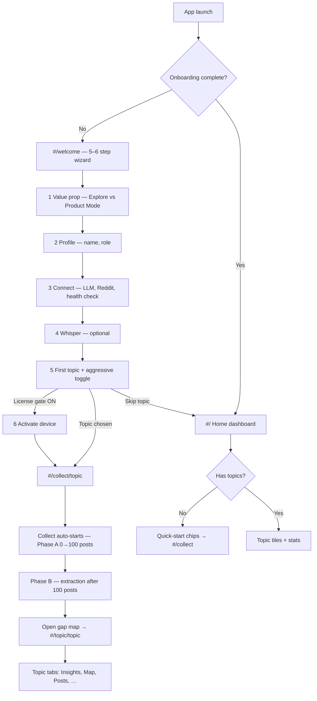

# New user journey — analysis & recommendations

**Date:** 2026-05-28  
**Scope:** Gap Map desktop app (`app-tauri`) — onboarding wizard through first collect, topic map, and dashboard.  
**Audience:** Product, design, and engineering planning first-run UX.

---

## Executive summary

Gap Map has a **solid structural journey** (welcome wizard → collect with Phase A/B progress → topic map / Insights). The main gap for new users is **time-to-aha**: the default path favors a long aggressive collect and a busy empty dashboard before data exists. This document maps the current flow, what works, where users stall, and a prioritized plan to make the first session feel successful in under five minutes.

---

## Current journey map

Gap Map has two entry paths and a gated shell. Most DMG builds use the **gate-off** path (5 wizard steps; device activation optional).

### Boot and routing constraints

| Mechanism | Behavior |
|-----------|----------|
| `gapmap.onboarding.completed` | Until set, router forces `#/welcome`; tab strip hidden. |
| `mustStayInOnboarding()` | Also checks licence activation when `GAPMAP_LICENSE_GATE_ENABLED` is on. |
| First launch warmup | Home may show 10–30s banner while macOS verifies the PyInstaller sidecar. |
| Collect on mount | `renderCollect` auto-calls `startCollect`; onboarding only needs `#/collect/<topic>`. |
| State keys | `gapmap.onboarding.step`, `gapmap.onboarding.pending_topic`, `gapmap.collect.last_aggressive`, profile in `gapmap.profile.*`. |

**Primary source files**

- `app-tauri/src/screens/welcome.js` — 6-step wizard (step 6 conditional on licence gate)
- `app-tauri/src/main.js` — routing, onboarding gate, `gapmapOpenNewTopic`
- `app-tauri/src/screens/home.js` — dashboard, empty state, quick-start chips, warmup banner
- `app-tauri/src/screens/collect.js` — Phase A/B UI, auto-start collect, post-run CTA

---

## Wizard steps (detail)

| Step | Label | Purpose |
|------|--------|---------|
| 1 | What is Gap Map | Value prop; branch to **Product Mode** (`#/product/new/setup`) or continue exploring |
| 2 | Your profile | Display name, optional email, role — local only |
| 3 | Connect sources | BYOK LLM providers, Reddit OAuth, system health card — all optional |
| 4 | Video transcription | Optional Whisper model download |
| 5 | Your first topic | Topic input, example tiles, **aggressive mode** toggle |
| 6 | Activate device | Only when licence gate enabled; otherwise skipped |

**Post step 5 (gate off)**

- `markOnboardingComplete()`
- MCP bootstrap (fire-and-forget)
- Route: `pending_route` → else `#/collect/<topic>` → else `#/`

**Post step 6 (gate on)**

- Licence activation via API; then same routing with pending topic.

---

## Collect → topic payoff loop

1. User lands on `#/collect/<topic>`.
2. `aggressive` read from `gapmap.collect.last_aggressive` (then cleared one-shot); default is **true** when key unset (`!== 'false'`).
3. **Phase A:** progress toward 100 posts; ETA copy on collect screen.
4. **Phase B:** “Extracting insights…” after threshold; live findings counter.
5. On success: **Open gap map →** navigates to `#/topic/<slug>`.
6. Insights tab shows Minto-structured brief when synthesis has run (requires LLM for full experience).

---

## What already works for new users

| Stage | Why it helps |
|-------|----------------|
| Step 1 | Clear 4-step pipeline story (topic → fetch → synthesise → map). |
| Step 2 | Low-friction profile; no account required. |
| Step 3 | “All optional” framing + live health check; BYOK modal without leaving wizard. |
| Step 5 | Example tiles + aggressive mode explained (~15 min first run). |
| Collect screen | Phase A/B card, recon source list, “Open gap map” CTA — strong progress narrative. |
| Empty home | Quick-start chips route to collect with copy about Minto brief. |
| Gate-off default | Skip activation → collect → value without licence wall. |
| Activation heal | `healActivationFlagsFromBackend()` avoids bouncing licensed users back to welcome. |

---

## Friction points (where new users get stuck)

### 1. Time-to-aha is long and opaque upfront

- Aggressive collect defaults **on** when `gapmap.pref.aggressive` / `last_aggressive` are unset.
- Phase B (meaningful extraction narrative) needs **100 posts**; aggressive first run can take **15+ minutes**.
- Step 5 button text says “Continue to activation →” even when licence gate is off.

**Impact:** Users abandon before seeing Insights or assume the app is broken during long collect.

### 2. Onboarding does not close the loop to the payoff screen

After collect, users must discover **“Open gap map →”**. The wizard does not say: wait here, then open Insights.

**Impact:** Users return to empty home or wander tabs without seeing the Minto brief.

### 3. Empty home is busy but not guided

Before the first topic, the dashboard shows skeletons, momentum chart, activity feed, BYOK nudge, palace nudge, products card — mostly empty. Users who **skip step 5** lack a single dominant CTA beyond quick-start chips.

**Impact:** Cognitive overload; unclear “what do I do now?”

### 4. “LLM optional” in copy vs experience

Collect works without keys; Insights, Sentiment, Trends, Audience often show “add a key in Settings” after a long collect.

**Impact:** Feels like a failed run despite successful ingest.

### 5. Two mental models too early (Explore vs Product)

Step 1 branches to Product Mode setup. Mis-clicks send users down a different path before first collect.

**Impact:** Delayed or confused first research win.

### 6. First-launch technical anxiety

Warmup banner on home helps, but step 3 health check can show failing rows while the user is still internalizing step 1.

**Impact:** Trust drop before first action.

### 7. Copy and implementation inconsistencies

| Issue | Location |
|-------|----------|
| “Activation is required” in step 1 bullets while gate is often off | `welcome.js` step 1 |
| `loadTopicGrid` called from delete handler when not on home (fixed: null guard on `#topics-subtitle`) | `home.js` |
| `gapmap:start-collect` fired from re-collect context menu but not required for onboarding path | `home.js` / `main.js` |

---

## Recommended “new user OS” (prioritized)

### P0 — Ship feel in under 5 minutes

1. **Default first collect to quick mode** (Reddit-only, shorter run). Offer “Deep collect (all sources, ~15 min)” as explicit opt-in after first success or from topic page.
2. **First collect completion → auto-route to Insights** (or blocking modal: “Your brief is ready — View insights”).
3. **Empty home = one hero CTA**; hide or collapse secondary widgets until `topics.length >= 1`.

### P1 — Set expectations

4. **Step 5:** side-by-side quick vs aggressive (time, sources, when brief appears).
5. **Step 3:** if `readyCount === 0`, soft warning before starting first topic — collect works; synthesis needs one provider (Ollama is free). Allow skip with clear expectation.
6. **Fix labels** for gate-off: step 5 button, step 1 activation bullet.

### P2 — Retention after first session

7. **Home checklist** after first topic: Collect done → Open Insights → Build audience → Run Improve (3 linked items).
8. **Audience nudge** on topic page only after collect has posts (existing pattern; verify timing).
9. **Resume wizard** via `gapmap.onboarding.step` if user quits mid-flow.

### P3 — Power users

10. Defer **Product Mode** branch until after first successful explore collect.
11. Persona auto-ingest off by default; explain after first brief.

---

## Success metrics

| Metric | Target signal |
|--------|----------------|
| **Activation** | % completing step 5 with a topic (not skip) |
| **Time to first post** | &lt; 3 min from wizard end on quick mode |
| **Time to first Insights view** | &lt; 10 min quick / &lt; 20 min aggressive |
| **D1 return** | Same topic re-opened or second topic started |
| **BYOK** | LLM key added within 24h if Insights was empty |

---

## Implementation notes (for engineering)

### Changing default collect mode

- Onboarding step 5: default `#ob-aggressive` unchecked; set `gapmap.pref.aggressive` to `'false'` for new profiles unless user opts in.
- `collect.js`: consider default `aggressive = false` when `last_aggressive` unset (breaking change for power users — gate with `gapmap.onboarding.completed` timestamp or `gapmap.first_collect.done`).

### Post-collect redirect

- In `collect.js` on `collect:done` with `code === 0`, if `!localStorage.getItem('gapmap.first_collect.done')`:
  - Set flag
  - `location.hash = '#/topic/<slug>?tab=insights'` (if topic router supports tab query)

### Empty home simplification

- `loadTopicGrid` / `renderHome`: when `topics.length === 0`, add class `home--first-run` on root and hide `#top-opportunities-slot`, BYOK card, etc. via CSS or conditional render.

### Copy fixes (low effort)

- `welcome.js` step 1: conditional bullet for activation requirement based on `_licenseGateEnabled`.
- Step 5 `start-5` label: “Continue →” when gate off; “Continue to activation →” when gate on.

---

## Related docs

- `docs/HOW_TO_USE.md` — end-user usage
- `changelogs/2026-04-21_20_whisper-reuse-and-onboarding.md` — onboarding history
- `docs/superpowers/specs/2026-04-19-app-ui-guidelines.md` — UI patterns
- `app-tauri/src/screens/welcome.js` — source of truth for wizard

---

## Changelog

| Date | Change |
|------|--------|
| 2026-05-28 | Initial analysis document |
